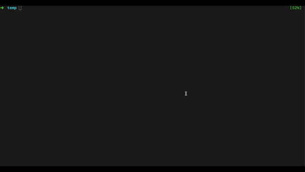

> Bang or Shebang (#!)

It's a simple line on top of file, which is nothing but the absolute path to the Bash interpreter. If its not set, by default the terminal process will try to execute `/bin/sh`.

This isn't limited to shell scripts. All text based script files use this. Eg:

```
#!/usr/bin/perl
#!/usr/local/bin/python
#!/usr/local/bin/ruby
```


