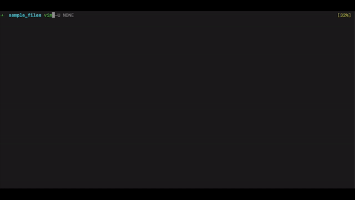

## Read output of external command
> :r !{cmd}

### Use case:
Many times we need to insert values which can be easily accessed in shell, and for that we can use the command. 

For example: we can use the `:read` (or `:r`) to insert the date to current vim file. 
> :r !date

